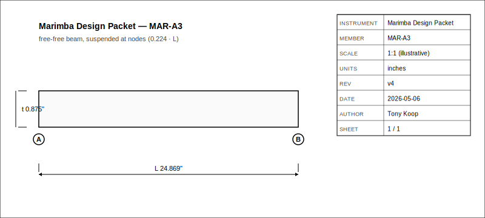
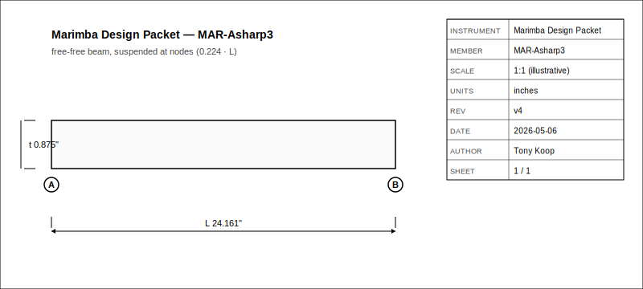

# Marimba CNC Bar And Resonator Build Packet
- Musical instrument documentation capstone
- Build packet: marimba
- Generated: 2026-05-06

---

# Project Intent
- Build a 37-bar C3-C6 marimba packet from the existing workbook design table. The first build target is a CNC-friendly instrument with African Padauk bars, parabolic underside arch undercuts, drilled node supports, quarter-wave resonators, and a frame layout that can become a SolidWorks master sketch.

_Speaker notes:_ Read design.md before committing to dimensions or sourcing decisions.

---

# Physics Model
- ### Bar Pitch

```
lambda_1 = 4.730
f_1 = (lambda_1^2 / (2*pi*L^2)) * sqrt(E*I/(rho*A))
```

```
f ~= K * t / L^2
L ~= sqrt(K * t / f)
```

```
K = 155502
t = 0.875 in
```

```
node_1 = 0.224 * L
node_2 = 0.776 * L
```

```
arch_depth = (edge_thickness - min_center_thickness) * min(1, (96 - midi)/48)
center_thickness = edge_thickness - arch_depth
```

```
L_res = 13552 / (4 * f) - 0.82 * bore
```

_Speaker notes:_ Governing equations extracted verbatim from design.md. Apply empirical corrections (NAF K2, scale offsets) only where the model permits — see references/acoustic-models.md.

---

# Hardware Alignment
- The support rails follow the node path rather than a fixed straight rail. For each bar:

_Speaker notes:_ Identifies which shop pipeline(s) this instrument lives in: Bambu+kiln slip-cast, 40W laser flat-pack, CNC+lathe, segmented turning, drum-skin work, or hybrid combinations.

---

# How To Use This Packet
- Start with design.md for intent and assumptions.
- Use bom.csv, sourcing.csv, and cut-list.csv before buying or cutting.
- Use drawing-brief.md and CAD/CNC folders before machining.
- Print the packet for shopping, shop work, and validation.

---

# File Map
- design.md: Project intent, catalog metadata, assumptions, and validation plan.
- bom.csv: Starter bill of materials with part categories, quantities, drawing refs, and notes.
- sourcing.csv: Supplier/search tracker with specs, price/date fields, lead time, substitutes, and risks.
- cut-list.csv: Rough/final stock sizes, material, grain/orientation, operations, yield, and offcuts.
- drawing-brief.md: Manufacturing drawing and technical product sketch brief.
- jig-decision.md: Fixture decision record and pilot jig release gates.
- assembly-manual.md: Shop-facing sequence, tools, fixtures, safety, tuning, finishing, and maintenance notes.
- validation.csv: Target/measured values, tolerance, environment, result, and tuning/build action log.
- supplier-rfq.md: Supplier email/request-for-quote starter.

---

# Family Spec

| member_id | target_note | midi | target_hz | predicted_length_in | predicted_width_in | predicted_thick_in | node_1_in | node_2_in | arch_depth_in | center_thickness_in | resonator_length_in | resonator_bore_in | material | k_constant | scale_label | notes |
| --- | --- | --- | --- | --- | --- | --- | --- | --- | --- | --- | --- | --- | --- | --- | --- | --- |
| MAR-C3 | C3 | 48 | 130.813 | 32.251 | 2.000 | 0.875 | 7.224 | 25.027 | 0.625 | 0.250 | 24.260 | 2.000 | African Padauk | 155502 | C3-C6 chromatic | Workbook-derived from Marimba sheet; resonator bore currently follows width/end-correction proxy. |
| MAR-Csharp3 | C#3 | 49 | 138.591 | 31.333 | 2.000 | 0.875 | 7.019 | 24.315 | 0.612 | 0.263 | 22.806 | 2.000 | African Padauk | 155502 | C3-C6 chromatic | Workbook-derived from Marimba sheet; resonator bore currently follows width/end-correction proxy. |
| MAR-D3 | D3 | 50 | 146.832 | 30.441 | 2.000 | 0.875 | 6.819 | 23.622 | 0.599 | 0.276 | 21.434 | 2.000 | African Padauk | 155502 | C3-C6 chromatic | Workbook-derived from Marimba sheet; resonator bore currently follows width/end-correction proxy. |
| MAR-Dsharp3 | D#3 | 51 | 155.563 | 29.575 | 2.000 | 0.875 | 6.625 | 22.950 | 0.586 | 0.289 | 20.139 | 2.000 | African Padauk | 155502 | C3-C6 chromatic | Workbook-derived from Marimba sheet; resonator bore currently follows width/end-correction proxy. |
| MAR-E3 | E3 | 52 | 164.814 | 28.733 | 2.000 | 0.875 | 6.436 | 22.297 | 0.573 | 0.302 | 18.917 | 2.000 | African Padauk | 155502 | C3-C6 chromatic | Workbook-derived from Marimba sheet; resonator bore currently follows width/end-correction proxy. |
| MAR-F3 | F3 | 53 | 174.614 | 27.915 | 2.000 | 0.875 | 6.253 | 21.662 | 0.560 | 0.315 | 17.763 | 2.000 | African Padauk | 155502 | C3-C6 chromatic | Workbook-derived from Marimba sheet; resonator bore currently follows width/end-correction proxy. |
| MAR-Fsharp3 | F#3 | 54 | 184.997 | 27.120 | 2.000 | 0.875 | 6.075 | 21.045 | 0.547 | 0.328 | 16.674 | 2.000 | African Padauk | 155502 | C3-C6 chromatic | Workbook-derived from Marimba sheet; resonator bore currently follows width/end-correction proxy. |
| MAR-G3 | G3 | 55 | 195.998 | 26.348 | 2.000 | 0.875 | 5.902 | 20.446 | 0.534 | 0.341 | 15.646 | 2.000 | African Padauk | 155502 | C3-C6 chromatic | Workbook-derived from Marimba sheet; resonator bore currently follows width/end-correction proxy. |
| MAR-Gsharp3 | G#3 | 56 | 207.652 | 25.598 | 2.000 | 0.875 | 5.734 | 19.864 | 0.521 | 0.354 | 14.676 | 2.000 | African Padauk | 155502 | C3-C6 chromatic | Workbook-derived from Marimba sheet; resonator bore currently follows width/end-correction proxy. |
| MAR-A3 | A3 | 57 | 220.000 | 24.869 | 2.000 | 0.875 | 5.571 | 19.298 | 0.508 | 0.367 | 13.760 | 2.000 | African Padauk | 155502 | C3-C6 chromatic | Workbook-derived from Marimba sheet; resonator bore currently follows width/end-correction proxy. |
| MAR-Asharp3 | A#3 | 58 | 233.082 | 24.161 | 2.000 | 0.875 | 5.412 | 18.749 | 0.495 | 0.380 | 12.896 | 2.000 | African Padauk | 155502 | C3-C6 chromatic | Workbook-derived from Marimba sheet; resonator bore currently follows width/end-correction proxy. |
| MAR-B3 | B3 | 59 | 246.942 | 23.473 | 2.000 | 0.875 | 5.258 | 18.215 | 0.482 | 0.393 | 12.080 | 2.000 | African Padauk | 155502 | C3-C6 chromatic | Workbook-derived from Marimba sheet; resonator bore currently follows width/end-correction proxy. |
| MAR-C4 | C4 | 60 | 261.626 | 22.805 | 1.750 | 0.875 | 5.108 | 17.697 | 0.469 | 0.406 | 11.515 | 1.750 | African Padauk | 155502 | C3-C6 chromatic | Workbook-derived from Marimba sheet; resonator bore currently follows width/end-correction proxy. |
| MAR-Csharp4 | C#4 | 61 | 277.183 | 22.156 | 1.750 | 0.875 | 4.963 | 17.193 | 0.456 | 0.419 | 10.788 | 1.750 | African Padauk | 155502 | C3-C6 chromatic | Workbook-derived from Marimba sheet; resonator bore currently follows width/end-correction proxy. |
| MAR-D4 | D4 | 62 | 293.665 | 21.525 | 1.750 | 0.875 | 4.822 | 16.704 | 0.443 | 0.432 | 10.102 | 1.750 | African Padauk | 155502 | C3-C6 chromatic | Workbook-derived from Marimba sheet; resonator bore currently follows width/end-correction proxy. |
| MAR-Dsharp4 | D#4 | 63 | 311.127 | 20.912 | 1.750 | 0.875 | 4.684 | 16.228 | 0.430 | 0.445 | 9.454 | 1.750 | African Padauk | 155502 | C3-C6 chromatic | Workbook-derived from Marimba sheet; resonator bore currently follows width/end-correction proxy. |
| MAR-E4 | E4 | 64 | 329.628 | 20.317 | 1.750 | 0.875 | 4.551 | 15.766 | 0.417 | 0.458 | 8.843 | 1.750 | African Padauk | 155502 | C3-C6 chromatic | Workbook-derived from Marimba sheet; resonator bore currently follows width/end-correction proxy. |
| MAR-F4 | F4 | 65 | 349.228 | 19.739 | 1.750 | 0.875 | 4.421 | 15.317 | 0.404 | 0.471 | 8.266 | 1.750 | African Padauk | 155502 | C3-C6 chromatic | Workbook-derived from Marimba sheet; resonator bore currently follows width/end-correction proxy. |
| MAR-Fsharp4 | F#4 | 66 | 369.994 | 19.177 | 1.750 | 0.875 | 4.296 | 14.881 | 0.391 | 0.484 | 7.722 | 1.750 | African Padauk | 155502 | C3-C6 chromatic | Workbook-derived from Marimba sheet; resonator bore currently follows width/end-correction proxy. |
| MAR-G4 | G4 | 67 | 391.995 | 18.631 | 1.750 | 0.875 | 4.173 | 14.458 | 0.378 | 0.497 | 7.208 | 1.750 | African Padauk | 155502 | C3-C6 chromatic | Workbook-derived from Marimba sheet; resonator bore currently follows width/end-correction proxy. |
| MAR-Gsharp4 | G#4 | 68 | 415.305 | 18.100 | 1.750 | 0.875 | 4.054 | 14.046 | 0.365 | 0.510 | 6.723 | 1.750 | African Padauk | 155502 | C3-C6 chromatic | Workbook-derived from Marimba sheet; resonator bore currently follows width/end-correction proxy. |
| MAR-A4 | A4 | 69 | 440.000 | 17.585 | 1.750 | 0.875 | 3.939 | 13.646 | 0.352 | 0.523 | 6.265 | 1.750 | African Padauk | 155502 | C3-C6 chromatic | Workbook-derived from Marimba sheet; resonator bore currently follows width/end-correction proxy. |
| MAR-Asharp4 | A#4 | 70 | 466.164 | 17.085 | 1.750 | 0.875 | 3.827 | 13.258 | 0.339 | 0.536 | 5.833 | 1.750 | African Padauk | 155502 | C3-C6 chromatic | Workbook-derived from Marimba sheet; resonator bore currently follows width/end-correction proxy. |
| MAR-B4 | B4 | 71 | 493.883 | 16.598 | 1.750 | 0.875 | 3.718 | 12.880 | 0.326 | 0.549 | 5.425 | 1.750 | African Padauk | 155502 | C3-C6 chromatic | Workbook-derived from Marimba sheet; resonator bore currently follows width/end-correction proxy. |
| MAR-C5 | C5 | 72 | 523.251 | 16.126 | 1.500 | 0.875 | 3.612 | 12.513 | 0.312 | 0.562 | 5.245 | 1.500 | African Padauk | 155502 | C3-C6 chromatic | Workbook-derived from Marimba sheet; resonator bore currently follows width/end-correction proxy. |
| MAR-Csharp5 | C#5 | 73 | 554.365 | 15.667 | 1.500 | 0.875 | 3.509 | 12.157 | 0.299 | 0.576 | 4.881 | 1.500 | African Padauk | 155502 | C3-C6 chromatic | Workbook-derived from Marimba sheet; resonator bore currently follows width/end-correction proxy. |
| MAR-D5 | D5 | 74 | 587.330 | 15.221 | 1.500 | 0.875 | 3.409 | 11.811 | 0.286 | 0.589 | 4.538 | 1.500 | African Padauk | 155502 | C3-C6 chromatic | Workbook-derived from Marimba sheet; resonator bore currently follows width/end-correction proxy. |
| MAR-Dsharp5 | D#5 | 75 | 622.254 | 14.787 | 1.500 | 0.875 | 3.312 | 11.475 | 0.273 | 0.602 | 4.215 | 1.500 | African Padauk | 155502 | C3-C6 chromatic | Workbook-derived from Marimba sheet; resonator bore currently follows width/end-correction proxy. |
| MAR-E5 | E5 | 76 | 659.255 | 14.366 | 1.500 | 0.875 | 3.218 | 11.148 | 0.260 | 0.615 | 3.909 | 1.500 | African Padauk | 155502 | C3-C6 chromatic | Workbook-derived from Marimba sheet; resonator bore currently follows width/end-correction proxy. |
| MAR-F5 | F5 | 77 | 698.456 | 13.957 | 1.500 | 0.875 | 3.126 | 10.831 | 0.247 | 0.628 | 3.621 | 1.500 | African Padauk | 155502 | C3-C6 chromatic | Workbook-derived from Marimba sheet; resonator bore currently follows width/end-correction proxy. |
| MAR-Fsharp5 | F#5 | 78 | 739.989 | 13.560 | 1.500 | 0.875 | 3.037 | 10.523 | 0.234 | 0.641 | 3.348 | 1.500 | African Padauk | 155502 | C3-C6 chromatic | Workbook-derived from Marimba sheet; resonator bore currently follows width/end-correction proxy. |
| MAR-G5 | G5 | 79 | 783.991 | 13.174 | 1.500 | 0.875 | 2.951 | 10.223 | 0.221 | 0.654 | 3.091 | 1.500 | African Padauk | 155502 | C3-C6 chromatic | Workbook-derived from Marimba sheet; resonator bore currently follows width/end-correction proxy. |
| MAR-Gsharp5 | G#5 | 80 | 830.609 | 12.799 | 1.500 | 0.875 | 2.867 | 9.932 | 0.208 | 0.667 | 2.849 | 1.500 | African Padauk | 155502 | C3-C6 chromatic | Workbook-derived from Marimba sheet; resonator bore currently follows width/end-correction proxy. |
| MAR-A5 | A5 | 81 | 880.000 | 12.435 | 1.500 | 0.875 | 2.785 | 9.649 | 0.195 | 0.680 | 2.620 | 1.500 | African Padauk | 155502 | C3-C6 chromatic | Workbook-derived from Marimba sheet; resonator bore currently follows width/end-correction proxy. |
| MAR-Asharp5 | A#5 | 82 | 932.328 | 12.081 | 1.500 | 0.875 | 2.706 | 9.375 | 0.182 | 0.693 | 2.404 | 1.500 | African Padauk | 155502 | C3-C6 chromatic | Workbook-derived from Marimba sheet; resonator bore currently follows width/end-correction proxy. |
| MAR-B5 | B5 | 83 | 987.767 | 11.737 | 1.500 | 0.875 | 2.629 | 9.108 | 0.169 | 0.706 | 2.200 | 1.500 | African Padauk | 155502 | C3-C6 chromatic | Workbook-derived from Marimba sheet; resonator bore currently follows width/end-correction proxy. |
| MAR-C6 | C6 | 84 | 1046.502 | 11.403 | 1.250 | 0.875 | 2.554 | 8.848 | 0.156 | 0.719 | 2.212 | 1.250 | African Padauk | 155502 | C3-C6 chromatic | Workbook-derived from Marimba sheet; resonator bore currently follows width/end-correction proxy. |

_Speaker notes:_ Sizes scale via the master scale factor; tuning targets are first-order Helmholtz/cantilever predictions to be empirically corrected per prototype.

---

# Build Workflow
- Design and assumptions
- Source materials and hardware
- Prepare stock, fixtures, and CNC/laser/lathe setup
- Build the pilot jig set from jig-decision.md before committing full stock
- Assemble, tune, finish, and validate

---

# Sourcing And BOM
- BOM gives part categories and drawing references.
- Sourcing tracks search terms, supplier candidates, price/date, lead time, substitutions.
- Visual BOM brief turns the parts list into a presentation-ready image board.

---

# Shop Packet
- Cut list for lumber/sheet/blank planning.
- Assembly manual for away-from-keyboard work.
- Validation sheet for measured dimensions, tuning, pass/fail checks.

---

# Drawings, CAD, CNC
- drawing-brief.md defines required views, dimensions, datums, sketch intent.
- cad/ holds models and design tables.
- cnc/ holds CAM, toolpaths, setup sheets, dry-run notes.
- drawings/ holds PDFs, SVGs, DXFs, drawing exports.






---

# Images And Screenshots
- Add hero render/photo, visual BOM, shop screenshots, drawing previews, validation photos in images/.

---

# Validation Plan
- A4 = 440 Hz reference check.
- Tuning targets logged in validation.csv.
- Critical dimensions verified against design sheet and CAD.
- Photos and revision notes after each major step.

---

# Open Risks / Decisions
- TBDs in design sheet and BOM.
- Supplier price/availability not yet verified.
- Generated images marked as concept placeholders.
- Empirical corrections await measured prototype data.
- Full 37-bar fixture is blocked until C3/A4/C6 pilot validation rows pass.

---

# Next Actions
- Replace TBDs with measured/source-backed values.
- Verify live supplier price and availability before buying.
- Export final drawings and visual BOM images.
- Regenerate this deck and print packet after final edits.

---
